# Projects and dependencies analysis

This document provides a comprehensive overview of the projects and their dependencies in the context of upgrading to .NETCoreApp,Version=v10.0.

## Table of Contents

- [Executive Summary](#executive-Summary)
  - [Highlevel Metrics](#highlevel-metrics)
  - [Projects Compatibility](#projects-compatibility)
  - [Package Compatibility](#package-compatibility)
  - [API Compatibility](#api-compatibility)
- [Aggregate NuGet packages details](#aggregate-nuget-packages-details)
- [Top API Migration Challenges](#top-api-migration-challenges)
  - [Technologies and Features](#technologies-and-features)
  - [Most Frequent API Issues](#most-frequent-api-issues)
- [Projects Relationship Graph](#projects-relationship-graph)
- [Project Details](#project-details)

  - [Cassette.React\Cassette.React.csproj](#cassettereactcassettereactcsproj)
  - [D:\Code\_github\React.NET\tests\React.Tests.Benchmarks\React.Tests.Benchmarks.csproj](#d:code_githubreactnettestsreacttestsbenchmarksreacttestsbenchmarkscsproj)
  - [D:\Code\_github\React.NET\tests\React.Tests.Common\React.Tests.Common.csproj](#d:code_githubreactnettestsreacttestscommonreacttestscommoncsproj)
  - [D:\Code\_github\React.NET\tests\React.Tests.Integration\React.Tests.Integration.csproj](#d:code_githubreactnettestsreacttestsintegrationreacttestsintegrationcsproj)
  - [D:\Code\_github\React.NET\tests\React.Tests\React.Tests.csproj](#d:code_githubreactnettestsreacttestsreacttestscsproj)
  - [React.AspNet.Middleware\React.AspNet.Middleware.csproj](#reactaspnetmiddlewarereactaspnetmiddlewarecsproj)
  - [React.AspNet\React.AspNet.csproj](#reactaspnetreactaspnetcsproj)
  - [React.Core\React.Core.csproj](#reactcorereactcorecsproj)
  - [React.MSBuild\React.MSBuild.csproj](#reactmsbuildreactmsbuildcsproj)
  - [React.Owin\React.Owin.csproj](#reactowinreactowincsproj)
  - [React.Router.Mvc4\React.Router.Mvc4.csproj](#reactroutermvc4reactroutermvc4csproj)
  - [React.Router\React.Router.csproj](#reactrouterreactroutercsproj)
  - [React.Sample.ConsoleApp\React.Sample.ConsoleApp.csproj](#reactsampleconsoleappreactsampleconsoleappcsproj)
  - [React.Sample.Owin\React.Sample.Owin.csproj](#reactsampleowinreactsampleowincsproj)
  - [React.Template\React.Template.csproj](#reacttemplatereacttemplatecsproj)
  - [React.Web.Mvc4\React.Web.Mvc4.csproj](#reactwebmvc4reactwebmvc4csproj)
  - [React.Web\React.Web.csproj](#reactwebreactwebcsproj)
  - [System.Web.Optimization.React\System.Web.Optimization.React.csproj](#systemweboptimizationreactsystemweboptimizationreactcsproj)

## Executive Summary

### Highlevel Metrics

| Metric | Count | Status |
| :--- | :---: | :--- |
| Total Projects | 18 | 17 require upgrade |
| Total NuGet Packages | 43 | 21 need upgrade |
| Total Code Files | 176 |  |
| Total Code Files with Incidents | 40 |  |
| Total Lines of Code | 16522 |  |
| Total Number of Issues | 300 |  |
| Estimated LOC to modify | 243+ | at least 1.5% of codebase |

### Projects Compatibility

| Project | Target Framework | Difficulty | Package Issues | API Issues | Est. LOC Impact | Description |
| :--- | :---: | :---: | :---: | :---: | :---: | :--- |
| [Cassette.React\Cassette.React.csproj](#cassettereactcassettereactcsproj) | net40 | 🟢 Low | 1 | 0 |  | ClassLibrary, Sdk Style = True |
| [D:\Code\_github\React.NET\tests\React.Tests.Benchmarks\React.Tests.Benchmarks.csproj](#d:code_githubreactnettestsreacttestsbenchmarksreacttestsbenchmarkscsproj) | net461;netcoreapp3.1 | 🟢 Low | 0 | 0 |  | DotNetCoreApp, Sdk Style = True |
| [D:\Code\_github\React.NET\tests\React.Tests.Common\React.Tests.Common.csproj](#d:code_githubreactnettestsreacttestscommonreacttestscommoncsproj) | net461;netcoreapp3.1 | 🟢 Low | 0 | 0 |  | ClassLibrary, Sdk Style = True |
| [D:\Code\_github\React.NET\tests\React.Tests.Integration\React.Tests.Integration.csproj](#d:code_githubreactnettestsreacttestsintegrationreacttestsintegrationcsproj) | net461;netcoreapp3.1 | 🟢 Low | 1 | 0 |  | ClassLibrary, Sdk Style = True |
| [D:\Code\_github\React.NET\tests\React.Tests\React.Tests.csproj](#d:code_githubreactnettestsreacttestsreacttestscsproj) | net452;netcoreapp3.1 | 🟢 Low | 1 | 26 | 26+ | ClassLibrary, Sdk Style = True |
| [React.AspNet.Middleware\React.AspNet.Middleware.csproj](#reactaspnetmiddlewarereactaspnetmiddlewarecsproj) | netstandard2.0;netcoreapp3.0 | 🟢 Low | 8 | 24 | 24+ | ClassLibrary, Sdk Style = True |
| [React.AspNet\React.AspNet.csproj](#reactaspnetreactaspnetcsproj) | netstandard2.0;netcoreapp3.0 | 🟢 Low | 1 | 0 |  | ClassLibrary, Sdk Style = True |
| [React.Core\React.Core.csproj](#reactcorereactcorecsproj) | net40;net45;netstandard2.0 | 🟢 Low | 2 | 37 | 37+ | ClassLibrary, Sdk Style = True |
| [React.MSBuild\React.MSBuild.csproj](#reactmsbuildreactmsbuildcsproj) | net40 | 🟢 Low | 0 | 0 |  | ClassLibrary, Sdk Style = True |
| [React.Owin\React.Owin.csproj](#reactowinreactowincsproj) | net45 | 🟢 Low | 6 | 0 |  | ClassLibrary, Sdk Style = True |
| [React.Router.Mvc4\React.Router.Mvc4.csproj](#reactroutermvc4reactroutermvc4csproj) | net451 | 🟢 Low | 1 | 25 | 25+ | ClassLibrary, Sdk Style = True |
| [React.Router\React.Router.csproj](#reactrouterreactroutercsproj) | netstandard2.0;netcoreapp3.0 | 🟢 Low | 2 | 0 |  | ClassLibrary, Sdk Style = True |
| [React.Sample.ConsoleApp\React.Sample.ConsoleApp.csproj](#reactsampleconsoleappreactsampleconsoleappcsproj) | net40;netcoreapp2.0 | 🟢 Low | 0 | 0 |  | DotNetCoreApp, Sdk Style = True |
| [React.Sample.Owin\React.Sample.Owin.csproj](#reactsampleowinreactsampleowincsproj) | net45 | 🟢 Low | 12 | 0 |  | DotNetCoreApp, Sdk Style = True |
| [React.Template\React.Template.csproj](#reacttemplatereacttemplatecsproj) | netstandard2.0 | ✅ None | 0 | 0 |  | ClassLibrary, Sdk Style = True |
| [React.Web.Mvc4\React.Web.Mvc4.csproj](#reactwebmvc4reactwebmvc4csproj) | net40 | 🟢 Low | 1 | 15 | 15+ | ClassLibrary, Sdk Style = True |
| [React.Web\React.Web.csproj](#reactwebreactwebcsproj) | net40 | 🟢 Low | 2 | 102 | 102+ | ClassLibrary, Sdk Style = True |
| [System.Web.Optimization.React\System.Web.Optimization.React.csproj](#systemweboptimizationreactsystemweboptimizationreactcsproj) | net40 | 🟢 Low | 2 | 14 | 14+ | ClassLibrary, Sdk Style = True |

### Package Compatibility

| Status | Count | Percentage |
| :--- | :---: | :---: |
| ✅ Compatible | 22 | 51.2% |
| ⚠️ Incompatible | 17 | 39.5% |
| 🔄 Upgrade Recommended | 4 | 9.3% |
| ***Total NuGet Packages*** | ***43*** | ***100%*** |

### API Compatibility

| Category | Count | Impact |
| :--- | :---: | :--- |
| 🔴 Binary Incompatible | 50 | High - Require code changes |
| 🟡 Source Incompatible | 190 | Medium - Needs re-compilation and potential conflicting API error fixing |
| 🔵 Behavioral change | 3 | Low - Behavioral changes that may require testing at runtime |
| ✅ Compatible | 9204 |  |
| ***Total APIs Analyzed*** | ***9447*** |  |

## Aggregate NuGet packages details

| Package | Current Version | Suggested Version | Projects | Description |
| :--- | :---: | :---: | :--- | :--- |
| BenchmarkDotNet | 0.10.14 |  | [React.Tests.Benchmarks.csproj](#d:code_githubreactnettestsreacttestsbenchmarksreacttestsbenchmarkscsproj) | ✅Compatible |
| Cassette | 2.4.2 |  | [Cassette.React.csproj](#cassettereactcassettereactcsproj) | ⚠️NuGet package is incompatible |
| JavaScriptEngineSwitcher.ChakraCore | 3.1.0 |  | [React.Tests.Benchmarks.csproj](#d:code_githubreactnettestsreacttestsbenchmarksreacttestsbenchmarkscsproj) [React.Tests.Integration.csproj](#d:code_githubreactnettestsreacttestsintegrationreacttestsintegrationcsproj) | ✅Compatible |
| JavaScriptEngineSwitcher.ChakraCore | 3.1.8 |  | [React.Sample.ConsoleApp.csproj](#reactsampleconsoleappreactsampleconsoleappcsproj) | ✅Compatible |
| JavaScriptEngineSwitcher.ChakraCore.Native.linux-x64 | 3.1.0 |  | [React.Tests.Benchmarks.csproj](#d:code_githubreactnettestsreacttestsbenchmarksreacttestsbenchmarkscsproj) [React.Tests.Integration.csproj](#d:code_githubreactnettestsreacttestsintegrationreacttestsintegrationcsproj) | ✅Compatible |
| JavaScriptEngineSwitcher.ChakraCore.Native.linux-x64 | 3.1.8 |  | [React.Sample.ConsoleApp.csproj](#reactsampleconsoleappreactsampleconsoleappcsproj) | ✅Compatible |
| JavaScriptEngineSwitcher.ChakraCore.Native.osx-x64 | 3.1.0 |  | [React.Tests.Benchmarks.csproj](#d:code_githubreactnettestsreacttestsbenchmarksreacttestsbenchmarkscsproj) [React.Tests.Integration.csproj](#d:code_githubreactnettestsreacttestsintegrationreacttestsintegrationcsproj) | ✅Compatible |
| JavaScriptEngineSwitcher.ChakraCore.Native.osx-x64 | 3.1.8 |  | [React.Sample.ConsoleApp.csproj](#reactsampleconsoleappreactsampleconsoleappcsproj) | ✅Compatible |
| JavaScriptEngineSwitcher.ChakraCore.Native.win-x64 | 3.1.0 |  | [React.Tests.Benchmarks.csproj](#d:code_githubreactnettestsreacttestsbenchmarksreacttestsbenchmarkscsproj) [React.Tests.Integration.csproj](#d:code_githubreactnettestsreacttestsintegrationreacttestsintegrationcsproj) | ✅Compatible |
| JavaScriptEngineSwitcher.ChakraCore.Native.win-x64 | 3.1.8 |  | [React.Sample.ConsoleApp.csproj](#reactsampleconsoleappreactsampleconsoleappcsproj) | ✅Compatible |
| JavaScriptEngineSwitcher.ChakraCore.Native.win-x86 | 3.1.0 |  | [React.Tests.Benchmarks.csproj](#d:code_githubreactnettestsreacttestsbenchmarksreacttestsbenchmarkscsproj) [React.Tests.Integration.csproj](#d:code_githubreactnettestsreacttestsintegrationreacttestsintegrationcsproj) | ✅Compatible |
| JavaScriptEngineSwitcher.Core | 3.1.0 |  | [React.Core.csproj](#reactcorereactcorecsproj) | ✅Compatible |
| JavaScriptEngineSwitcher.Msie | 3.1.0 |  | [Cassette.React.csproj](#cassettereactcassettereactcsproj) [React.MSBuild.csproj](#reactmsbuildreactmsbuildcsproj) | ✅Compatible |
| JavaScriptEngineSwitcher.V8 | 3.1.6 | 3.34.1 | [React.Sample.Owin.csproj](#reactsampleowinreactsampleowincsproj) | ⚠️NuGet package is incompatible |
| JavaScriptEngineSwitcher.V8.Native.win-x64 | 3.1.5 |  | [React.Sample.Owin.csproj](#reactsampleowinreactsampleowincsproj) | ✅Compatible |
| JSPool | 4.0.0 |  | [React.Core.csproj](#reactcorereactcorecsproj) | ✅Compatible |
| Microsoft.AspNet.Mvc | 4.0.40804 |  | [React.Router.Mvc4.csproj](#reactroutermvc4reactroutermvc4csproj) [React.Web.Mvc4.csproj](#reactwebmvc4reactwebmvc4csproj) | NuGet package functionality is included with framework reference |
| Microsoft.AspNet.Web.Optimization | 1.1.3 |  | [System.Web.Optimization.React.csproj](#systemweboptimizationreactsystemweboptimizationreactcsproj) | ⚠️NuGet package is incompatible |
| Microsoft.AspNetCore.Hosting.Abstractions | 2.2.0 |  | [React.AspNet.Middleware.csproj](#reactaspnetmiddlewarereactaspnetmiddlewarecsproj) | ⚠️NuGet package is deprecated |
| Microsoft.AspNetCore.Mvc.Core | 2.2.5 |  | [React.Router.csproj](#reactrouterreactroutercsproj) | ⚠️NuGet package is deprecated |
| Microsoft.AspNetCore.Mvc.ViewFeatures | 2.2.0 |  | [React.AspNet.csproj](#reactaspnetreactaspnetcsproj) [React.Router.csproj](#reactrouterreactroutercsproj) | ⚠️NuGet package is deprecated |
| Microsoft.AspNetCore.StaticFiles | 2.2.0 |  | [React.AspNet.Middleware.csproj](#reactaspnetmiddlewarereactaspnetmiddlewarecsproj) | ⚠️NuGet package is deprecated |
| Microsoft.Extensions.Caching.Abstractions | 2.2.0 | 10.0.8 | [React.AspNet.Middleware.csproj](#reactaspnetmiddlewarereactaspnetmiddlewarecsproj) | NuGet package upgrade is recommended |
| Microsoft.Extensions.DependencyInjection | 2.2.0 | 10.0.8 | [React.AspNet.Middleware.csproj](#reactaspnetmiddlewarereactaspnetmiddlewarecsproj) | NuGet package upgrade is recommended |
| Microsoft.Extensions.FileProviders.Physical | 2.2.0 | 10.0.8 | [React.AspNet.Middleware.csproj](#reactaspnetmiddlewarereactaspnetmiddlewarecsproj) | NuGet package upgrade is recommended |
| Microsoft.NET.Test.Sdk | 15.5.0 |  | [React.Tests.csproj](#d:code_githubreactnettestsreacttestsreacttestscsproj) [React.Tests.Integration.csproj](#d:code_githubreactnettestsreacttestsintegrationreacttestsintegrationcsproj) | ✅Compatible |
| Microsoft.Owin | 3.1.0 |  | [React.Owin.csproj](#reactowinreactowincsproj) [React.Sample.Owin.csproj](#reactsampleowinreactsampleowincsproj) | ⚠️NuGet package is incompatible |
| Microsoft.Owin.Diagnostics | 3.1.0 |  | [React.Sample.Owin.csproj](#reactsampleowinreactsampleowincsproj) | ⚠️NuGet package is incompatible |
| Microsoft.Owin.FileSystems | 3.1.0 |  | [React.Owin.csproj](#reactowinreactowincsproj) [React.Sample.Owin.csproj](#reactsampleowinreactsampleowincsproj) | ⚠️NuGet package is incompatible |
| Microsoft.Owin.Host.HttpListener | 3.1.0 |  | [React.Sample.Owin.csproj](#reactsampleowinreactsampleowincsproj) | ⚠️NuGet package is incompatible |
| Microsoft.Owin.Hosting | 3.1.0 |  | [React.Sample.Owin.csproj](#reactsampleowinreactsampleowincsproj) | ⚠️NuGet package is incompatible |
| Microsoft.Owin.SelfHost | 3.1.0 |  | [React.Sample.Owin.csproj](#reactsampleowinreactsampleowincsproj) | ✅Compatible |
| Microsoft.Owin.StaticFiles | 3.1.0 |  | [React.Owin.csproj](#reactowinreactowincsproj) [React.Sample.Owin.csproj](#reactsampleowinreactsampleowincsproj) | ⚠️NuGet package is incompatible |
| Microsoft.Sourcelink.Github | 1.0.0 |  | [Cassette.React.csproj](#cassettereactcassettereactcsproj) [React.AspNet.csproj](#reactaspnetreactaspnetcsproj) [React.AspNet.Middleware.csproj](#reactaspnetmiddlewarereactaspnetmiddlewarecsproj) [React.Core.csproj](#reactcorereactcorecsproj) [React.MSBuild.csproj](#reactmsbuildreactmsbuildcsproj) [React.Owin.csproj](#reactowinreactowincsproj) [React.Router.csproj](#reactrouterreactroutercsproj) [React.Router.Mvc4.csproj](#reactroutermvc4reactroutermvc4csproj) [React.Web.csproj](#reactwebreactwebcsproj) [React.Web.Mvc4.csproj](#reactwebmvc4reactwebmvc4csproj) [System.Web.Optimization.React.csproj](#systemweboptimizationreactsystemweboptimizationreactcsproj) | ✅Compatible |
| Microsoft.Web.Infrastructure | 1.0.0 |  | [React.Web.csproj](#reactwebreactwebcsproj) | NuGet package functionality is included with framework reference |
| Moq | 4.8.3 |  | [React.Tests.csproj](#d:code_githubreactnettestsreacttestsreacttestscsproj) | ✅Compatible |
| NETStandard.Library | 2.0.3 |  | [React.AspNet.csproj](#reactaspnetreactaspnetcsproj) [React.AspNet.Middleware.csproj](#reactaspnetmiddlewarereactaspnetmiddlewarecsproj) [React.Router.csproj](#reactrouterreactroutercsproj) [React.Template.csproj](#reacttemplatereacttemplatecsproj) | ✅Compatible |
| Newtonsoft.Json | 12.0.3 | 13.0.4 | [React.Core.csproj](#reactcorereactcorecsproj) [React.Sample.Owin.csproj](#reactsampleowinreactsampleowincsproj) | NuGet package upgrade is recommended |
| Owin | 1.0 |  | [React.Sample.Owin.csproj](#reactsampleowinreactsampleowincsproj) | ⚠️NuGet package is incompatible |
| Owin | 1.0.0 |  | [React.Owin.csproj](#reactowinreactowincsproj) | ⚠️NuGet package is incompatible |
| WebActivatorEx | 2.2.0 |  | [React.Web.csproj](#reactwebreactwebcsproj) | ⚠️NuGet package is incompatible |
| xunit | 2.3.1 |  | [React.Tests.csproj](#d:code_githubreactnettestsreacttestsreacttestscsproj) [React.Tests.Integration.csproj](#d:code_githubreactnettestsreacttestsintegrationreacttestsintegrationcsproj) | ⚠️NuGet package is deprecated |
| xunit.runner.visualstudio | 2.3.1 |  | [React.Tests.csproj](#d:code_githubreactnettestsreacttestsreacttestscsproj) [React.Tests.Integration.csproj](#d:code_githubreactnettestsreacttestsintegrationreacttestsintegrationcsproj) | ✅Compatible |

## Top API Migration Challenges

### Technologies and Features

| Technology | Issues | Percentage | Migration Path |
| :--- | :---: | :---: | :--- |
| ASP.NET Framework (System.Web) | 176 | 72.4% | Legacy ASP.NET Framework APIs for web applications (System.Web.*) that don't exist in ASP.NET Core due to architectural differences. ASP.NET Core represents a complete redesign of the web framework. Migrate to ASP.NET Core equivalents or consider System.Web.Adapters package for compatibility. |
| Legacy Cryptography | 1 | 0.4% | Obsolete or insecure cryptographic algorithms that have been deprecated for security reasons. These algorithms are no longer considered secure by modern standards. Migrate to modern cryptographic APIs using secure algorithms. |

### Most Frequent API Issues

| API | Count | Percentage | Category |
| :--- | :---: | :---: | :--- |
| T:Microsoft.AspNetCore.Hosting.IHostingEnvironment | 23 | 9.5% | Source Incompatible |
| T:System.Web.HttpResponseBase | 20 | 8.2% | Source Incompatible |
| T:System.Web.Mvc.HtmlHelper | 17 | 7.0% | Binary Incompatible |
| M:System.Exception.#ctor(System.Runtime.Serialization.SerializationInfo,System.Runtime.Serialization.StreamingContext) | 16 | 6.6% | Source Incompatible |
| T:System.Web.HttpRequestBase | 13 | 5.3% | Source Incompatible |
| P:System.Web.HttpResponseBase.StatusCode | 9 | 3.7% | Source Incompatible |
| T:System.Web.HttpContext | 9 | 3.7% | Source Incompatible |
| T:System.Web.Caching.Cache | 9 | 3.7% | Source Incompatible |
| T:System.Runtime.Caching.ObjectCache | 6 | 2.5% | Source Incompatible |
| P:System.Web.HttpRequestBase.QueryString | 5 | 2.1% | Source Incompatible |
| T:System.Web.HttpContextBase | 5 | 2.1% | Source Incompatible |
| T:System.Runtime.Caching.MemoryCache | 4 | 1.6% | Source Incompatible |
| T:System.Web.HtmlString | 4 | 1.6% | Source Incompatible |
| M:System.Web.HtmlString.#ctor(System.String) | 4 | 1.6% | Source Incompatible |
| P:System.Web.HttpContext.Current | 4 | 1.6% | Source Incompatible |
| P:System.Web.HttpRequestBase.Path | 3 | 1.2% | Source Incompatible |
| P:System.Web.HttpContext.Items | 3 | 1.2% | Source Incompatible |
| T:System.Web.HttpCachePolicyBase | 3 | 1.2% | Binary Incompatible |
| P:System.Web.HttpResponseBase.Cache | 3 | 1.2% | Source Incompatible |
| T:System.Uri | 3 | 1.2% | Behavioral Change |
| P:System.Web.HttpRequestBase.Url | 3 | 1.2% | Source Incompatible |
| P:System.Runtime.Caching.MemoryCache.Default | 2 | 0.8% | Source Incompatible |
| M:System.Web.HttpResponseBase.Redirect(System.String) | 2 | 0.8% | Source Incompatible |
| M:System.Web.HttpResponseBase.RedirectPermanent(System.String) | 2 | 0.8% | Source Incompatible |
| T:System.Web.Mvc.ViewContext | 2 | 0.8% | Binary Incompatible |
| P:System.Web.Mvc.HtmlHelper.ViewContext | 2 | 0.8% | Binary Incompatible |
| P:System.Web.Mvc.ControllerContext.HttpContext | 2 | 0.8% | Binary Incompatible |
| P:System.Web.HttpContextBase.Request | 2 | 0.8% | Source Incompatible |
| P:System.Web.HttpContextBase.Response | 2 | 0.8% | Source Incompatible |
| T:System.Web.Hosting.HostingEnvironment | 2 | 0.8% | Source Incompatible |
| T:System.Web.HttpCacheability | 2 | 0.8% | Source Incompatible |
| M:System.Web.HttpResponseBase.Write(System.String) | 2 | 0.8% | Source Incompatible |
| P:System.Web.HttpResponseBase.ContentType | 2 | 0.8% | Source Incompatible |
| M:System.Web.HttpResponseBase.AddHeader(System.String,System.String) | 2 | 0.8% | Source Incompatible |
| T:System.Web.Mvc.UrlHelper | 2 | 0.8% | Binary Incompatible |
| M:System.Web.Mvc.UrlHelper.Content(System.String) | 2 | 0.8% | Binary Incompatible |
| P:System.Web.Optimization.Bundle.ConcatenationToken | 2 | 0.8% | Binary Incompatible |
| M:System.Web.Optimization.Bundle.#ctor(System.String,System.Web.Optimization.IBundleTransform[]) | 2 | 0.8% | Binary Incompatible |
| P:System.Web.Optimization.BundleResponse.Content | 2 | 0.8% | Binary Incompatible |
| M:Microsoft.AspNetCore.StaticFiles.StaticFileMiddleware.#ctor(Microsoft.AspNetCore.Http.RequestDelegate,Microsoft.AspNetCore.Hosting.IHostingEnvironment,Microsoft.Extensions.Options.IOptions{Microsoft.AspNetCore.Builder.StaticFileOptions},Microsoft.Extensions.Logging.ILoggerFactory) | 1 | 0.4% | Binary Incompatible |
| M:System.TimeSpan.FromHours(System.Double) | 1 | 0.4% | Source Incompatible |
| M:System.Runtime.Caching.ObjectCache.Set(System.String,System.Object,System.Runtime.Caching.CacheItemPolicy,System.String) | 1 | 0.4% | Source Incompatible |
| T:System.Runtime.Caching.HostFileChangeMonitor | 1 | 0.4% | Source Incompatible |
| M:System.Runtime.Caching.HostFileChangeMonitor.#ctor(System.Collections.Generic.IList{System.String}) | 1 | 0.4% | Source Incompatible |
| P:System.Runtime.Caching.CacheItemPolicy.ChangeMonitors | 1 | 0.4% | Source Incompatible |
| P:System.Runtime.Caching.CacheItemPolicy.SlidingExpiration | 1 | 0.4% | Source Incompatible |
| T:System.Runtime.Caching.CacheItemPolicy | 1 | 0.4% | Source Incompatible |
| M:System.Runtime.Caching.CacheItemPolicy.#ctor | 1 | 0.4% | Source Incompatible |
| M:System.Runtime.Caching.ObjectCache.Remove(System.String,System.String) | 1 | 0.4% | Source Incompatible |
| M:System.Runtime.Caching.ObjectCache.Get(System.String,System.String) | 1 | 0.4% | Source Incompatible |

## Projects Relationship Graph

Legend:
📦 SDK-style project
⚙️ Classic project

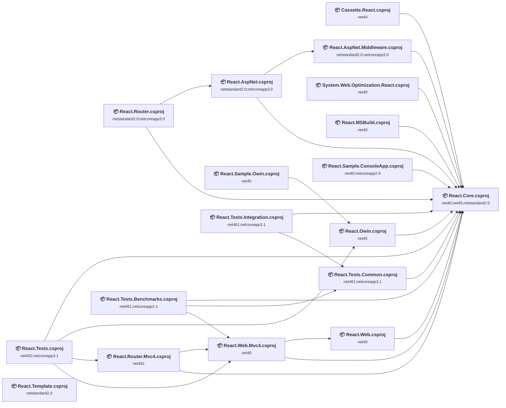

## Project Details

### Cassette.React\Cassette.React.csproj

#### Project Info

- **Current Target Framework:** net40
- **Proposed Target Framework:** net10.0
- **SDK-style**: True
- **Project Kind:** ClassLibrary
- **Dependencies**: 1
- **Dependants**: 0
- **Number of Files**: 11
- **Number of Files with Incidents**: 1
- **Lines of Code**: 333
- **Estimated LOC to modify**: 0+ (at least 0.0% of the project)

#### Dependency Graph

Legend:
📦 SDK-style project
⚙️ Classic project

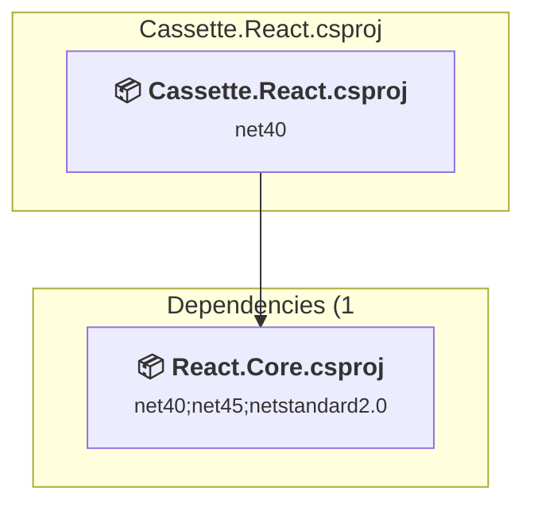

### API Compatibility

| Category | Count | Impact |
| :--- | :---: | :--- |
| 🔴 Binary Incompatible | 0 | High - Require code changes |
| 🟡 Source Incompatible | 0 | Medium - Needs re-compilation and potential conflicting API error fixing |
| 🔵 Behavioral change | 0 | Low - Behavioral changes that may require testing at runtime |
| ✅ Compatible | 95 |  |
| ***Total APIs Analyzed*** | ***95*** |  |

### D:\Code\_github\React.NET\tests\React.Tests.Benchmarks\React.Tests.Benchmarks.csproj

#### Project Info

- **Current Target Framework:** net461;netcoreapp3.1
- **Proposed Target Framework:** net461;netcoreapp3.1;net10.0
- **SDK-style**: True
- **Project Kind:** DotNetCoreApp
- **Dependencies**: 3
- **Dependants**: 0
- **Number of Files**: 5
- **Number of Files with Incidents**: 1
- **Lines of Code**: 145
- **Estimated LOC to modify**: 0+ (at least 0.0% of the project)

#### Dependency Graph

Legend:
📦 SDK-style project
⚙️ Classic project

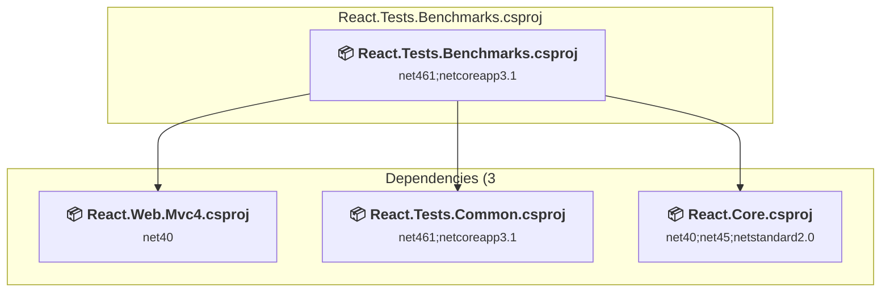

### API Compatibility

| Category | Count | Impact |
| :--- | :---: | :--- |
| 🔴 Binary Incompatible | 0 | High - Require code changes |
| 🟡 Source Incompatible | 0 | Medium - Needs re-compilation and potential conflicting API error fixing |
| 🔵 Behavioral change | 0 | Low - Behavioral changes that may require testing at runtime |
| ✅ Compatible | 77 |  |
| ***Total APIs Analyzed*** | ***77*** |  |

#### Project Package References

| Package | Type | Current Version | Suggested Version | Description |
| :--- | :---: | :---: | :---: | :--- |
| BenchmarkDotNet | Explicit | 0.10.14 |  | ✅Compatible |
| JavaScriptEngineSwitcher.ChakraCore | Explicit | 3.1.0 |  | ✅Compatible |
| JavaScriptEngineSwitcher.ChakraCore.Native.linux-x64 | Explicit | 3.1.0 |  | ✅Compatible |
| JavaScriptEngineSwitcher.ChakraCore.Native.osx-x64 | Explicit | 3.1.0 |  | ✅Compatible |
| JavaScriptEngineSwitcher.ChakraCore.Native.win-x64 | Explicit | 3.1.0 |  | ✅Compatible |
| JavaScriptEngineSwitcher.ChakraCore.Native.win-x86 | Explicit | 3.1.0 |  | ✅Compatible |

### D:\Code\_github\React.NET\tests\React.Tests.Common\React.Tests.Common.csproj

#### Project Info

- **Current Target Framework:** net461;netcoreapp3.1
- **Proposed Target Framework:** net461;netcoreapp3.1;net10.0
- **SDK-style**: True
- **Project Kind:** ClassLibrary
- **Dependencies**: 1
- **Dependants**: 2
- **Number of Files**: 2
- **Number of Files with Incidents**: 1
- **Lines of Code**: 110
- **Estimated LOC to modify**: 0+ (at least 0.0% of the project)

#### Dependency Graph

Legend:
📦 SDK-style project
⚙️ Classic project

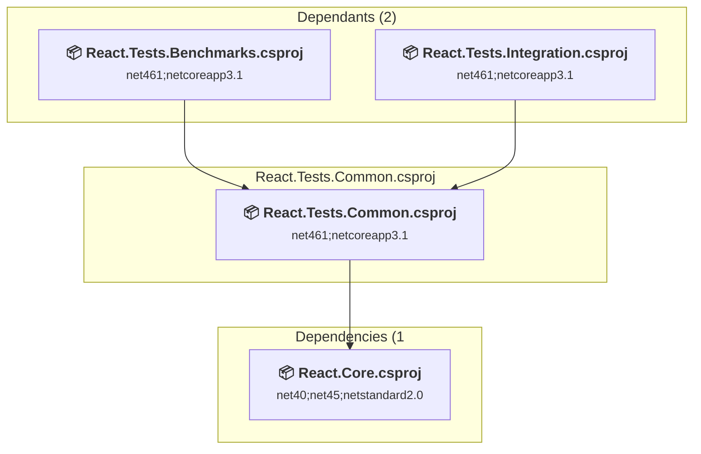

### API Compatibility

| Category | Count | Impact |
| :--- | :---: | :--- |
| 🔴 Binary Incompatible | 0 | High - Require code changes |
| 🟡 Source Incompatible | 0 | Medium - Needs re-compilation and potential conflicting API error fixing |
| 🔵 Behavioral change | 0 | Low - Behavioral changes that may require testing at runtime |
| ✅ Compatible | 35 |  |
| ***Total APIs Analyzed*** | ***35*** |  |

#### Project Package References

| Package | Type | Current Version | Suggested Version | Description |
| :--- | :---: | :---: | :---: | :--- |

### D:\Code\_github\React.NET\tests\React.Tests.Integration\React.Tests.Integration.csproj

#### Project Info

- **Current Target Framework:** net461;netcoreapp3.1
- **Proposed Target Framework:** net461;netcoreapp3.1;net10.0
- **SDK-style**: True
- **Project Kind:** ClassLibrary
- **Dependencies**: 2
- **Dependants**: 0
- **Number of Files**: 5
- **Number of Files with Incidents**: 1
- **Lines of Code**: 158
- **Estimated LOC to modify**: 0+ (at least 0.0% of the project)

#### Dependency Graph

Legend:
📦 SDK-style project
⚙️ Classic project

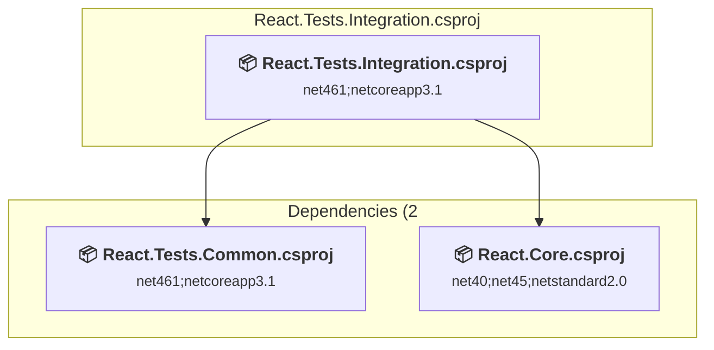

### API Compatibility

| Category | Count | Impact |
| :--- | :---: | :--- |
| 🔴 Binary Incompatible | 0 | High - Require code changes |
| 🟡 Source Incompatible | 0 | Medium - Needs re-compilation and potential conflicting API error fixing |
| 🔵 Behavioral change | 0 | Low - Behavioral changes that may require testing at runtime |
| ✅ Compatible | 165 |  |
| ***Total APIs Analyzed*** | ***165*** |  |

#### Project Package References

| Package | Type | Current Version | Suggested Version | Description |
| :--- | :---: | :---: | :---: | :--- |
| JavaScriptEngineSwitcher.ChakraCore | Explicit | 3.1.0 |  | ✅Compatible |
| JavaScriptEngineSwitcher.ChakraCore.Native.linux-x64 | Explicit | 3.1.0 |  | ✅Compatible |
| JavaScriptEngineSwitcher.ChakraCore.Native.osx-x64 | Explicit | 3.1.0 |  | ✅Compatible |
| JavaScriptEngineSwitcher.ChakraCore.Native.win-x64 | Explicit | 3.1.0 |  | ✅Compatible |
| JavaScriptEngineSwitcher.ChakraCore.Native.win-x86 | Explicit | 3.1.0 |  | ✅Compatible |
| Microsoft.NET.Test.Sdk | Explicit | 15.5.0 |  | ✅Compatible |
| xunit | Explicit | 2.3.1 |  | ✅Compatible |
| xunit.runner.visualstudio | Explicit | 2.3.1 |  | ✅Compatible |

### D:\Code\_github\React.NET\tests\React.Tests\React.Tests.csproj

#### Project Info

- **Current Target Framework:** net452;netcoreapp3.1
- **Proposed Target Framework:** net452;netcoreapp3.1;net10.0
- **SDK-style**: True
- **Project Kind:** ClassLibrary
- **Dependencies**: 4
- **Dependants**: 0
- **Number of Files**: 17
- **Number of Files with Incidents**: 3
- **Lines of Code**: 2729
- **Estimated LOC to modify**: 26+ (at least 1.0% of the project)

#### Dependency Graph

Legend:
📦 SDK-style project
⚙️ Classic project

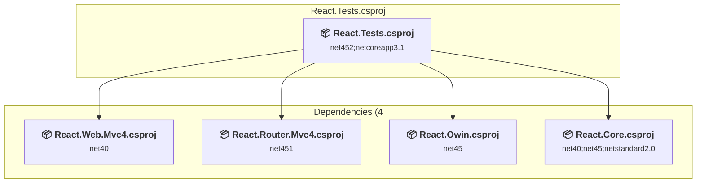

### API Compatibility

| Category | Count | Impact |
| :--- | :---: | :--- |
| 🔴 Binary Incompatible | 10 | High - Require code changes |
| 🟡 Source Incompatible | 16 | Medium - Needs re-compilation and potential conflicting API error fixing |
| 🔵 Behavioral change | 0 | Low - Behavioral changes that may require testing at runtime |
| ✅ Compatible | 3540 |  |
| ***Total APIs Analyzed*** | ***3566*** |  |

#### Project Package References

| Package | Type | Current Version | Suggested Version | Description |
| :--- | :---: | :---: | :---: | :--- |
| Microsoft.NET.Test.Sdk | Explicit | 15.5.0 |  | ✅Compatible |
| Moq | Explicit | 4.8.3 |  | ✅Compatible |
| xunit | Explicit | 2.3.1 |  | ⚠️NuGet package is deprecated |
| xunit.runner.visualstudio | Explicit | 2.3.1 |  | ✅Compatible |

#### Project Technologies and Features

| Technology | Issues | Percentage | Migration Path |
| :--- | :---: | :---: | :--- |
| ASP.NET Framework (System.Web) | 25 | 96.2% | Legacy ASP.NET Framework APIs for web applications (System.Web.*) that don't exist in ASP.NET Core due to architectural differences. ASP.NET Core represents a complete redesign of the web framework. Migrate to ASP.NET Core equivalents or consider System.Web.Adapters package for compatibility. |
| Legacy Cryptography | 1 | 3.8% | Obsolete or insecure cryptographic algorithms that have been deprecated for security reasons. These algorithms are no longer considered secure by modern standards. Migrate to modern cryptographic APIs using secure algorithms. |

### React.AspNet.Middleware\React.AspNet.Middleware.csproj

#### Project Info

- **Current Target Framework:** netstandard2.0;netcoreapp3.0
- **Proposed Target Framework:** netstandard2.0;netcoreapp3.0;net10.0
- **SDK-style**: True
- **Project Kind:** ClassLibrary
- **Dependencies**: 1
- **Dependants**: 1
- **Number of Files**: 11
- **Number of Files with Incidents**: 5
- **Lines of Code**: 794
- **Estimated LOC to modify**: 24+ (at least 3.0% of the project)

#### Dependency Graph

Legend:
📦 SDK-style project
⚙️ Classic project

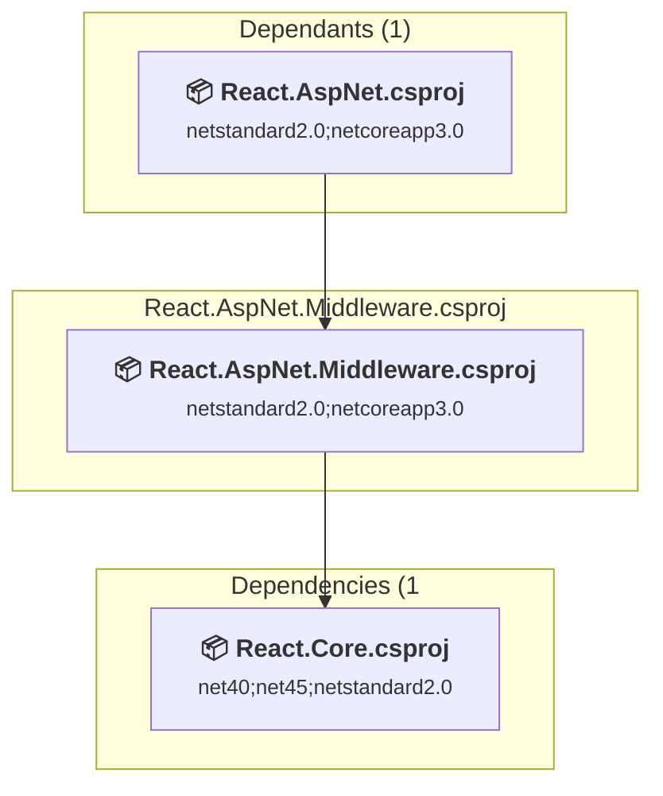

### API Compatibility

| Category | Count | Impact |
| :--- | :---: | :--- |
| 🔴 Binary Incompatible | 1 | High - Require code changes |
| 🟡 Source Incompatible | 23 | Medium - Needs re-compilation and potential conflicting API error fixing |
| 🔵 Behavioral change | 0 | Low - Behavioral changes that may require testing at runtime |
| ✅ Compatible | 309 |  |
| ***Total APIs Analyzed*** | ***333*** |  |

### React.AspNet\React.AspNet.csproj

#### Project Info

- **Current Target Framework:** netstandard2.0;netcoreapp3.0
- **Proposed Target Framework:** netstandard2.0;netcoreapp3.0;net10.0
- **SDK-style**: True
- **Project Kind:** ClassLibrary
- **Dependencies**: 2
- **Dependants**: 1
- **Number of Files**: 3
- **Number of Files with Incidents**: 1
- **Lines of Code**: 250
- **Estimated LOC to modify**: 0+ (at least 0.0% of the project)

#### Dependency Graph

Legend:
📦 SDK-style project
⚙️ Classic project

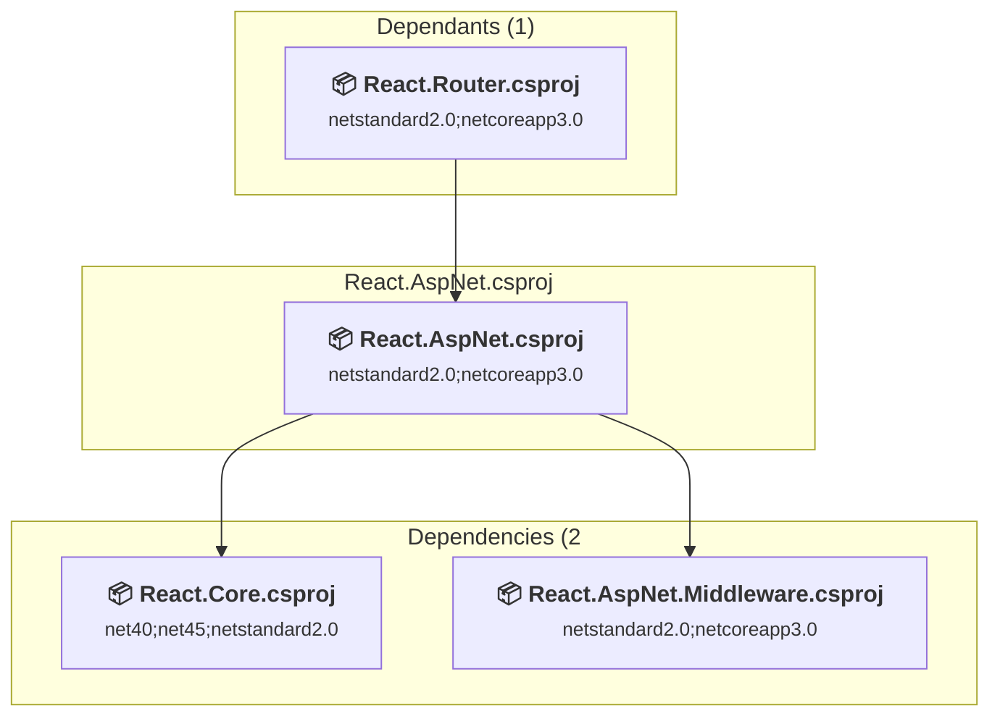

### API Compatibility

| Category | Count | Impact |
| :--- | :---: | :--- |
| 🔴 Binary Incompatible | 0 | High - Require code changes |
| 🟡 Source Incompatible | 0 | Medium - Needs re-compilation and potential conflicting API error fixing |
| 🔵 Behavioral change | 0 | Low - Behavioral changes that may require testing at runtime |
| ✅ Compatible | 123 |  |
| ***Total APIs Analyzed*** | ***123*** |  |

### React.Core\React.Core.csproj

#### Project Info

- **Current Target Framework:** net40;net45;netstandard2.0
- **Proposed Target Framework:** net40;net45;netstandard2.0;net10.0
- **SDK-style**: True
- **Project Kind:** ClassLibrary
- **Dependencies**: 0
- **Dependants**: 15
- **Number of Files**: 59
- **Number of Files with Incidents**: 6
- **Lines of Code**: 8913
- **Estimated LOC to modify**: 37+ (at least 0.4% of the project)

#### Dependency Graph

Legend:
📦 SDK-style project
⚙️ Classic project

```mermaid
flowchart TB
    subgraph upstream["Dependants (15)"]
        P2["<b>📦&nbsp;Cassette.React.csproj</b><br/><small>net40</small>"]
        P3["<b>📦&nbsp;React.Web.csproj</b><br/><small>net40</small>"]
        P4["<b>📦&nbsp;React.Web.Mvc4.csproj</b><br/><small>net40</small>"]
        P5["<b>📦&nbsp;System.Web.Optimization.React.csproj</b><br/><small>net40</small>"]
        P6["<b>📦&nbsp;React.MSBuild.csproj</b><br/><small>net40</small>"]
        P7["<b>📦&nbsp;React.Owin.csproj</b><br/><small>net45</small>"]
        P9["<b>📦&nbsp;React.Sample.ConsoleApp.csproj</b><br/><small>net40;netcoreapp2.0</small>"]
        P10["<b>📦&nbsp;React.Tests.csproj</b><br/><small>net452;netcoreapp3.1</small>"]
        P11["<b>📦&nbsp;React.AspNet.csproj</b><br/><small>netstandard2.0;netcoreapp3.0</small>"]
        P12["<b>📦&nbsp;React.Router.csproj</b><br/><small>netstandard2.0;netcoreapp3.0</small>"]
        P13["<b>📦&nbsp;React.AspNet.Middleware.csproj</b><br/><small>netstandard2.0;netcoreapp3.0</small>"]
        P14["<b>📦&nbsp;React.Router.Mvc4.csproj</b><br/><small>net451</small>"]
        P15["<b>📦&nbsp;React.Tests.Benchmarks.csproj</b><br/><small>net461;netcoreapp3.1</small>"]
        P16["<b>📦&nbsp;React.Tests.Integration.csproj</b><br/><small>net461;netcoreapp3.1</small>"]
        P17["<b>📦&nbsp;React.Tests.Common.csproj</b><br/><small>net461;netcoreapp3.1</small>"]
        click P2 "#cassettereactcassettereactcsproj"
        click P3 "#reactwebreactwebcsproj"
        click P4 "#reactwebmvc4reactwebmvc4csproj"
        click P5 "#systemweboptimizationreactsystemweboptimizationreactcsproj"
        click P6 "#reactmsbuildreactmsbuildcsproj"
        click P7 "#reactowinreactowincsproj"
        click P9 "#reactsampleconsoleappreactsampleconsoleappcsproj"
        click P10 "#d:code_githubreactnettestsreacttestsreacttestscsproj"
        click P11 "#reactaspnetreactaspnetcsproj"
        click P12 "#reactrouterreactroutercsproj"
        click P13 "#reactaspnetmiddlewarereactaspnetmiddlewarecsproj"
        click P14 "#reactroutermvc4reactroutermvc4csproj"
        click P15 "#d:code_githubreactnettestsreacttestsbenchmarksreacttestsbenchmarkscsproj"
        click P16 "#d:code_githubreactnettestsreacttestsintegrationreacttestsintegrationcsproj"
        click P17 "#d:code_githubreactnettestsreacttestscommonreacttestscommoncsproj"
    end
    subgraph current["React.Core.csproj"]
        MAIN["<b>📦&nbsp;React.Core.csproj</b><br/><small>net40;net45;netstandard2.0</small>"]
        click MAIN "#reactcorereactcorecsproj"
    end
    P2 --> MAIN
    P3 --> MAIN
    P4 --> MAIN
    P5 --> MAIN
    P6 --> MAIN
    P7 --> MAIN
    P9 --> MAIN
    P10 --> MAIN
    P11 --> MAIN
    P12 --> MAIN
    P13 --> MAIN
    P14 --> MAIN
    P15 --> MAIN
    P16 --> MAIN
    P17 --> MAIN

```

### API Compatibility

| Category | Count | Impact |
| :--- | :---: | :--- |
| 🔴 Binary Incompatible | 0 | High - Require code changes |
| 🟡 Source Incompatible | 37 | Medium - Needs re-compilation and potential conflicting API error fixing |
| 🔵 Behavioral change | 0 | Low - Behavioral changes that may require testing at runtime |
| ✅ Compatible | 3537 |  |
| ***Total APIs Analyzed*** | ***3574*** |  |

### React.MSBuild\React.MSBuild.csproj

#### Project Info

- **Current Target Framework:** net40
- **Proposed Target Framework:** net10.0
- **SDK-style**: True
- **Project Kind:** ClassLibrary
- **Dependencies**: 1
- **Dependants**: 0
- **Number of Files**: 10
- **Number of Files with Incidents**: 1
- **Lines of Code**: 288
- **Estimated LOC to modify**: 0+ (at least 0.0% of the project)

#### Dependency Graph

Legend:
📦 SDK-style project
⚙️ Classic project

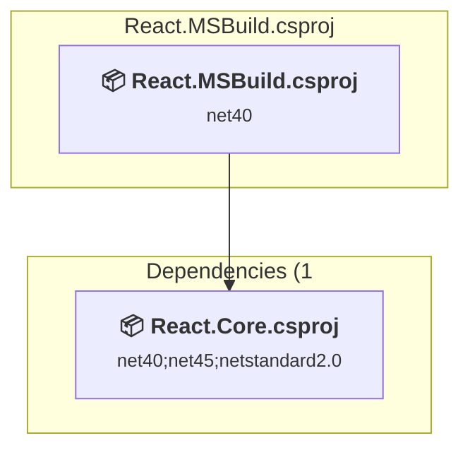

### API Compatibility

| Category | Count | Impact |
| :--- | :---: | :--- |
| 🔴 Binary Incompatible | 0 | High - Require code changes |
| 🟡 Source Incompatible | 0 | Medium - Needs re-compilation and potential conflicting API error fixing |
| 🔵 Behavioral change | 0 | Low - Behavioral changes that may require testing at runtime |
| ✅ Compatible | 159 |  |
| ***Total APIs Analyzed*** | ***159*** |  |

### React.Owin\React.Owin.csproj

#### Project Info

- **Current Target Framework:** net45
- **Proposed Target Framework:** net10.0
- **SDK-style**: True
- **Project Kind:** ClassLibrary
- **Dependencies**: 1
- **Dependants**: 2
- **Number of Files**: 9
- **Number of Files with Incidents**: 1
- **Lines of Code**: 479
- **Estimated LOC to modify**: 0+ (at least 0.0% of the project)

#### Dependency Graph

Legend:
📦 SDK-style project
⚙️ Classic project

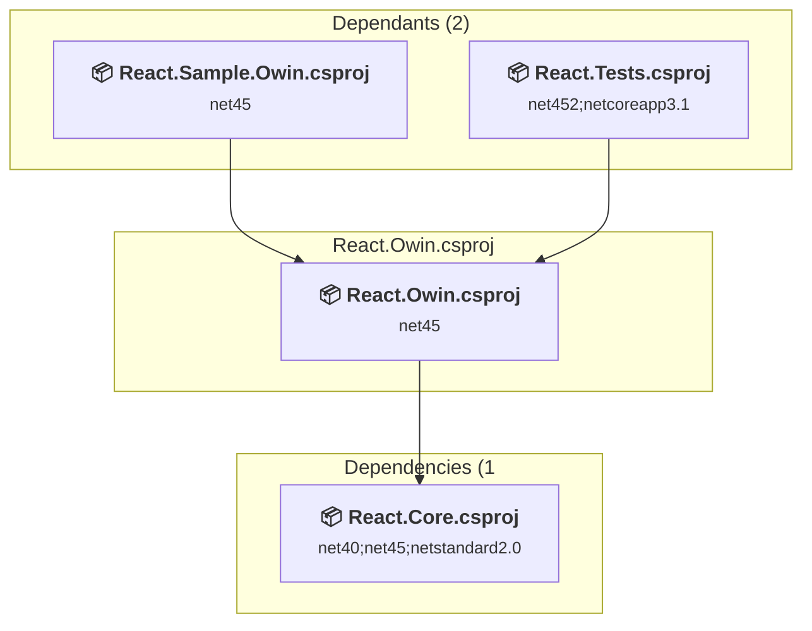

### API Compatibility

| Category | Count | Impact |
| :--- | :---: | :--- |
| 🔴 Binary Incompatible | 0 | High - Require code changes |
| 🟡 Source Incompatible | 0 | Medium - Needs re-compilation and potential conflicting API error fixing |
| 🔵 Behavioral change | 0 | Low - Behavioral changes that may require testing at runtime |
| ✅ Compatible | 197 |  |
| ***Total APIs Analyzed*** | ***197*** |  |

### React.Router.Mvc4\React.Router.Mvc4.csproj

#### Project Info

- **Current Target Framework:** net451
- **Proposed Target Framework:** net10.0
- **SDK-style**: True
- **Project Kind:** ClassLibrary
- **Dependencies**: 2
- **Dependants**: 1
- **Number of Files**: 11
- **Number of Files with Incidents**: 4
- **Lines of Code**: 539
- **Estimated LOC to modify**: 25+ (at least 4.6% of the project)

#### Dependency Graph

Legend:
📦 SDK-style project
⚙️ Classic project

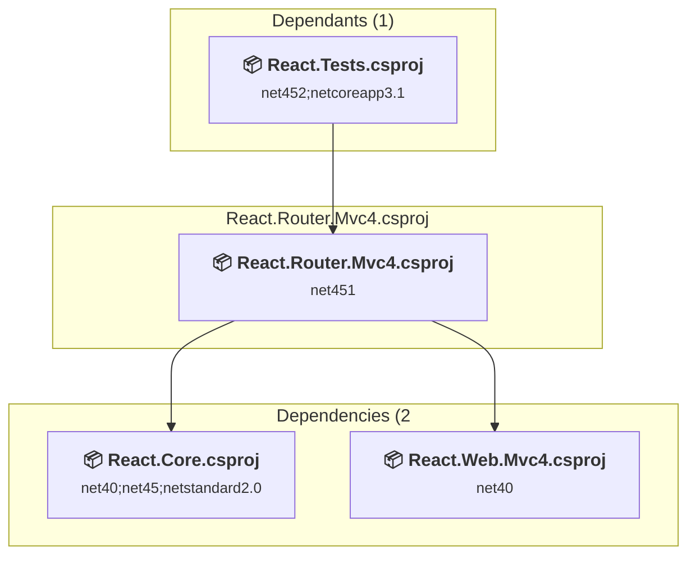

### API Compatibility

| Category | Count | Impact |
| :--- | :---: | :--- |
| 🔴 Binary Incompatible | 8 | High - Require code changes |
| 🟡 Source Incompatible | 17 | Medium - Needs re-compilation and potential conflicting API error fixing |
| 🔵 Behavioral change | 0 | Low - Behavioral changes that may require testing at runtime |
| ✅ Compatible | 188 |  |
| ***Total APIs Analyzed*** | ***213*** |  |

#### Project Technologies and Features

| Technology | Issues | Percentage | Migration Path |
| :--- | :---: | :---: | :--- |
| ASP.NET Framework (System.Web) | 23 | 92.0% | Legacy ASP.NET Framework APIs for web applications (System.Web.*) that don't exist in ASP.NET Core due to architectural differences. ASP.NET Core represents a complete redesign of the web framework. Migrate to ASP.NET Core equivalents or consider System.Web.Adapters package for compatibility. |

### React.Router\React.Router.csproj

#### Project Info

- **Current Target Framework:** netstandard2.0;netcoreapp3.0
- **Proposed Target Framework:** netstandard2.0;netcoreapp3.0;net10.0
- **SDK-style**: True
- **Project Kind:** ClassLibrary
- **Dependencies**: 2
- **Dependants**: 0
- **Number of Files**: 11
- **Number of Files with Incidents**: 1
- **Lines of Code**: 546
- **Estimated LOC to modify**: 0+ (at least 0.0% of the project)

#### Dependency Graph

Legend:
📦 SDK-style project
⚙️ Classic project

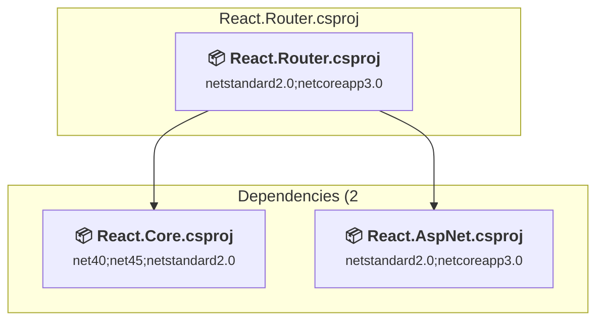

### API Compatibility

| Category | Count | Impact |
| :--- | :---: | :--- |
| 🔴 Binary Incompatible | 0 | High - Require code changes |
| 🟡 Source Incompatible | 0 | Medium - Needs re-compilation and potential conflicting API error fixing |
| 🔵 Behavioral change | 0 | Low - Behavioral changes that may require testing at runtime |
| ✅ Compatible | 201 |  |
| ***Total APIs Analyzed*** | ***201*** |  |

### React.Sample.ConsoleApp\React.Sample.ConsoleApp.csproj

#### Project Info

- **Current Target Framework:** net40;netcoreapp2.0
- **Proposed Target Framework:** net40;netcoreapp2.0;net10.0
- **SDK-style**: True
- **Project Kind:** DotNetCoreApp
- **Dependencies**: 1
- **Dependants**: 0
- **Number of Files**: 4
- **Number of Files with Incidents**: 1
- **Lines of Code**: 74
- **Estimated LOC to modify**: 0+ (at least 0.0% of the project)

#### Dependency Graph

Legend:
📦 SDK-style project
⚙️ Classic project

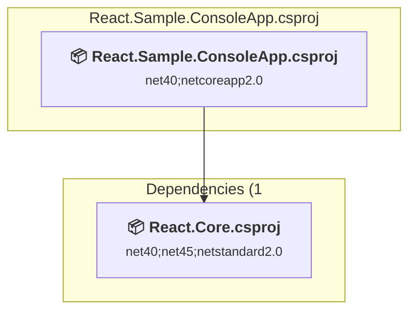

### API Compatibility

| Category | Count | Impact |
| :--- | :---: | :--- |
| 🔴 Binary Incompatible | 0 | High - Require code changes |
| 🟡 Source Incompatible | 0 | Medium - Needs re-compilation and potential conflicting API error fixing |
| 🔵 Behavioral change | 0 | Low - Behavioral changes that may require testing at runtime |
| ✅ Compatible | 28 |  |
| ***Total APIs Analyzed*** | ***28*** |  |

### React.Sample.Owin\React.Sample.Owin.csproj

#### Project Info

- **Current Target Framework:** net45
- **Proposed Target Framework:** net10.0
- **SDK-style**: True
- **Project Kind:** DotNetCoreApp
- **Dependencies**: 1
- **Dependants**: 0
- **Number of Files**: 6
- **Number of Files with Incidents**: 1
- **Lines of Code**: 195
- **Estimated LOC to modify**: 0+ (at least 0.0% of the project)

#### Dependency Graph

Legend:
📦 SDK-style project
⚙️ Classic project

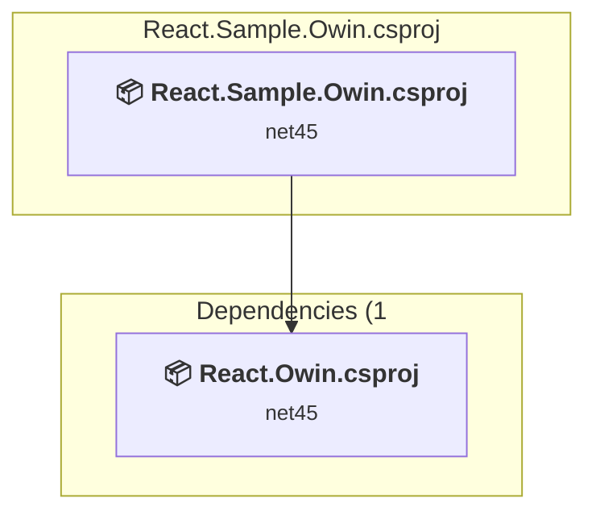

### API Compatibility

| Category | Count | Impact |
| :--- | :---: | :--- |
| 🔴 Binary Incompatible | 0 | High - Require code changes |
| 🟡 Source Incompatible | 0 | Medium - Needs re-compilation and potential conflicting API error fixing |
| 🔵 Behavioral change | 0 | Low - Behavioral changes that may require testing at runtime |
| ✅ Compatible | 266 |  |
| ***Total APIs Analyzed*** | ***266*** |  |

### React.Template\React.Template.csproj

#### Project Info

- **Current Target Framework:** netstandard2.0✅
- **SDK-style**: True
- **Project Kind:** ClassLibrary
- **Dependencies**: 0
- **Dependants**: 0
- **Number of Files**: 42
- **Lines of Code**: 63
- **Estimated LOC to modify**: 0+ (at least 0.0% of the project)

#### Dependency Graph

Legend:
📦 SDK-style project
⚙️ Classic project

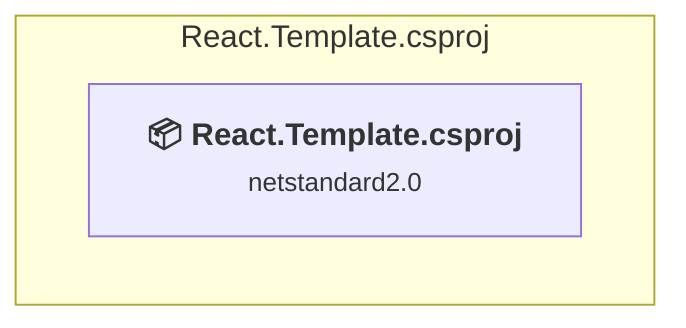

### API Compatibility

| Category | Count | Impact |
| :--- | :---: | :--- |
| 🔴 Binary Incompatible | 0 | High - Require code changes |
| 🟡 Source Incompatible | 0 | Medium - Needs re-compilation and potential conflicting API error fixing |
| 🔵 Behavioral change | 0 | Low - Behavioral changes that may require testing at runtime |
| ✅ Compatible | 0 |  |
| ***Total APIs Analyzed*** | ***0*** |  |

### React.Web.Mvc4\React.Web.Mvc4.csproj

#### Project Info

- **Current Target Framework:** net40
- **Proposed Target Framework:** net10.0
- **SDK-style**: True
- **Project Kind:** ClassLibrary
- **Dependencies**: 2
- **Dependants**: 3
- **Number of Files**: 5
- **Number of Files with Incidents**: 2
- **Lines of Code**: 257
- **Estimated LOC to modify**: 15+ (at least 5.8% of the project)

#### Dependency Graph

Legend:
📦 SDK-style project
⚙️ Classic project

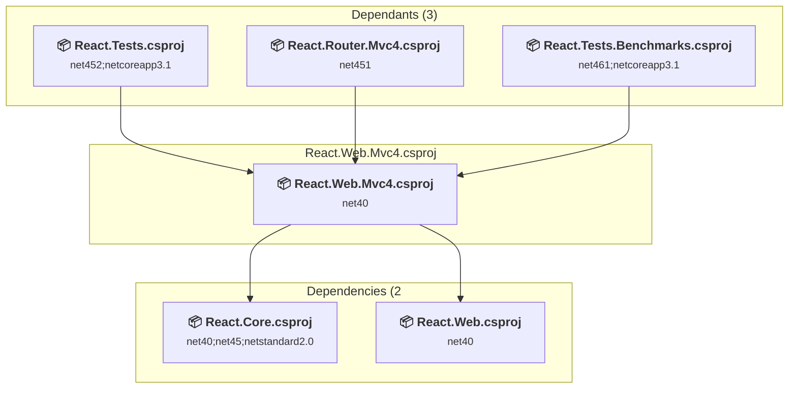

### API Compatibility

| Category | Count | Impact |
| :--- | :---: | :--- |
| 🔴 Binary Incompatible | 9 | High - Require code changes |
| 🟡 Source Incompatible | 6 | Medium - Needs re-compilation and potential conflicting API error fixing |
| 🔵 Behavioral change | 0 | Low - Behavioral changes that may require testing at runtime |
| ✅ Compatible | 108 |  |
| ***Total APIs Analyzed*** | ***123*** |  |

#### Project Technologies and Features

| Technology | Issues | Percentage | Migration Path |
| :--- | :---: | :---: | :--- |
| ASP.NET Framework (System.Web) | 15 | 100.0% | Legacy ASP.NET Framework APIs for web applications (System.Web.*) that don't exist in ASP.NET Core due to architectural differences. ASP.NET Core represents a complete redesign of the web framework. Migrate to ASP.NET Core equivalents or consider System.Web.Adapters package for compatibility. |

### React.Web\React.Web.csproj

#### Project Info

- **Current Target Framework:** net40
- **Proposed Target Framework:** net10.0
- **SDK-style**: True
- **Project Kind:** ClassLibrary
- **Dependencies**: 1
- **Dependants**: 1
- **Number of Files**: 14
- **Number of Files with Incidents**: 7
- **Lines of Code**: 551
- **Estimated LOC to modify**: 102+ (at least 18.5% of the project)

#### Dependency Graph

Legend:
📦 SDK-style project
⚙️ Classic project

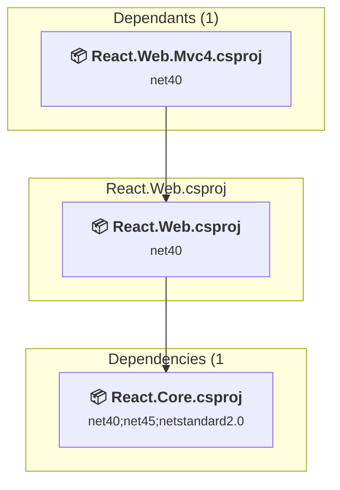

### API Compatibility

| Category | Count | Impact |
| :--- | :---: | :--- |
| 🔴 Binary Incompatible | 8 | High - Require code changes |
| 🟡 Source Incompatible | 91 | Medium - Needs re-compilation and potential conflicting API error fixing |
| 🔵 Behavioral change | 3 | Low - Behavioral changes that may require testing at runtime |
| ✅ Compatible | 151 |  |
| ***Total APIs Analyzed*** | ***253*** |  |

#### Project Technologies and Features

| Technology | Issues | Percentage | Migration Path |
| :--- | :---: | :---: | :--- |
| ASP.NET Framework (System.Web) | 99 | 97.1% | Legacy ASP.NET Framework APIs for web applications (System.Web.*) that don't exist in ASP.NET Core due to architectural differences. ASP.NET Core represents a complete redesign of the web framework. Migrate to ASP.NET Core equivalents or consider System.Web.Adapters package for compatibility. |

### System.Web.Optimization.React\System.Web.Optimization.React.csproj

#### Project Info

- **Current Target Framework:** net40
- **Proposed Target Framework:** net10.0
- **SDK-style**: True
- **Project Kind:** ClassLibrary
- **Dependencies**: 1
- **Dependants**: 0
- **Number of Files**: 6
- **Number of Files with Incidents**: 3
- **Lines of Code**: 98
- **Estimated LOC to modify**: 14+ (at least 14.3% of the project)

#### Dependency Graph

Legend:
📦 SDK-style project
⚙️ Classic project

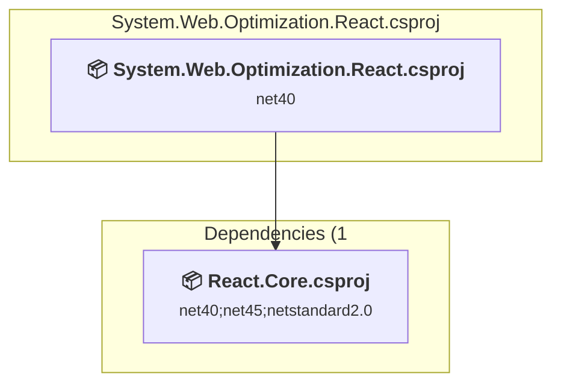

### API Compatibility

| Category | Count | Impact |
| :--- | :---: | :--- |
| 🔴 Binary Incompatible | 14 | High - Require code changes |
| 🟡 Source Incompatible | 0 | Medium - Needs re-compilation and potential conflicting API error fixing |
| 🔵 Behavioral change | 0 | Low - Behavioral changes that may require testing at runtime |
| ✅ Compatible | 25 |  |
| ***Total APIs Analyzed*** | ***39*** |  |

#### Project Technologies and Features

| Technology | Issues | Percentage | Migration Path |
| :--- | :---: | :---: | :--- |
| ASP.NET Framework (System.Web) | 14 | 100.0% | Legacy ASP.NET Framework APIs for web applications (System.Web.*) that don't exist in ASP.NET Core due to architectural differences. ASP.NET Core represents a complete redesign of the web framework. Migrate to ASP.NET Core equivalents or consider System.Web.Adapters package for compatibility. |

